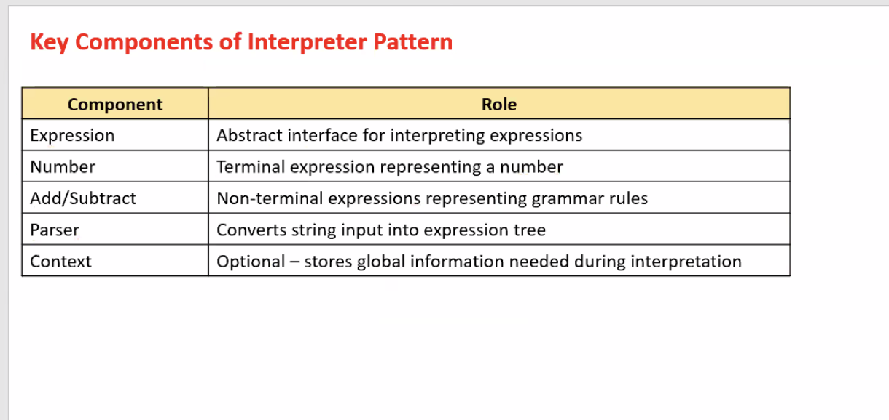

# Introduction to Interpreter Design Pattern

The Interpreter Design Pattern defines a representation for a language's grammar along with an interpreter that uses the representation to interpret sentences in the language. 

It is used to:
 - Interpret expressions of a simple language.
 - Convert sentences into abstract syntax trees and evaluate them.


In Java Language,

```plaintext

                                +----------------+
                                |  Source Code   |
                                +----------------+
                                        |
                                        v
                                +----------------+
                                |    Compile     |
                                +----------------+
                                        |
                                        v
                                +----------------+
                                |   Byte Code    |
                                +----------------+
                                        |
                        +---------------+--------------+
                        |               |              |
                        v               v              v
                  +-----------+   +-----------+   +-----------+
                  |    JVM    |   |    JVM    |   |    JVM    |
                  +-----------+   +-----------+   +-----------+
                        |               |              |
                        v               v              v
                  +-----------+   +-----------+   +-----------+
                  |  Windows  |   |   Linux   |   |   MacOS   |
                  +-----------+   +-----------+   +-----------+

```

## Characteristics of Interpreter Pattern

 - Defines a grammar for a simple language.
 - Includes classes for each grammar rule (Terminal and non-terminal expressions).
 - Recursively interprets expressions.
 - Often used in compilers, query languages, calculators, etc..
 - Easy to extend with new rules.


## Key Components of Interpreter Pattern




## Advantages
 - Easy to add new grammar rules.
 - Great for small domain-specific languages (DSLs).
 - Recursive structure matches grammer naturally.
 - Encourages modular class design.

## Disadvantages
 - Complex grammars become hard to manage.
 - Many small classes can clutter the codebase.
 - Inefficient for performance-critical parsing (applications).
 - Difficult to use for full programming languages.