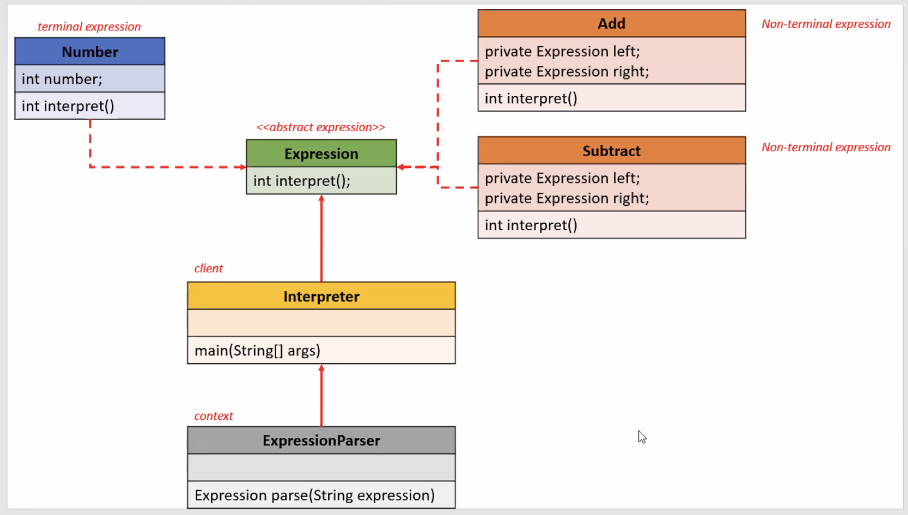

# Real-World Example: Mathematical Expression Evaluator

## Problem Statement:

Imagine you are building a simple claculator that takes user input as a string (eg. "10 - 2 + 4") and returns the correct result. At first glance, this looks simply - just parse the number and operations and evaluate.

But what if later you want to:
 - Add new operations like multiplication or division?
 - Support parentheses for operation precedence? (eg. "10 - (2 + 4)")
 - Handle complex rules (eg. custom priority levels, functions like sqrt(16)).


## Without Interpreter Pattern:

```java
class Calculator {

    public int calc(String expression) {

        String token[] = expression.split(" ");
        int result = Integer.parseInt(token[0]);

        for (int i = 1; i < token.length; i += 2) {
            String operator = token[i];
            int number = Integer.parseInt(token[i + 1]);

            switch (operator) {
                case "+":
                    result += number;
                    break;
                case "-":
                    result -= number;
                    break;
                default:
                    break;
            }

        }

        return result;
    }
}

public class Interpreter {

    public static void main(String[] args) {
     
        Calculator calculator = new Calculator();
        System.out.println("Result : " + calculator.calc("3 + 5 - 2"));

    }
    
}

```

### Problem with this approach:
 - Hardcoded logic.
 - Difficult to extend (eg. adding *, /, parantheses).
 - No clear structure for grammar.


## Class diagram of example with Interpreter Pattern:

