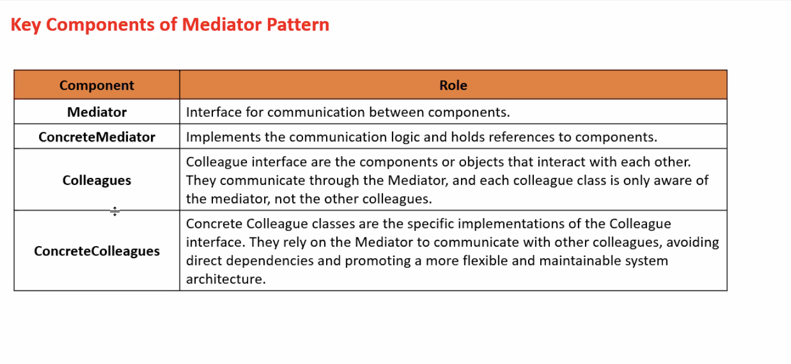
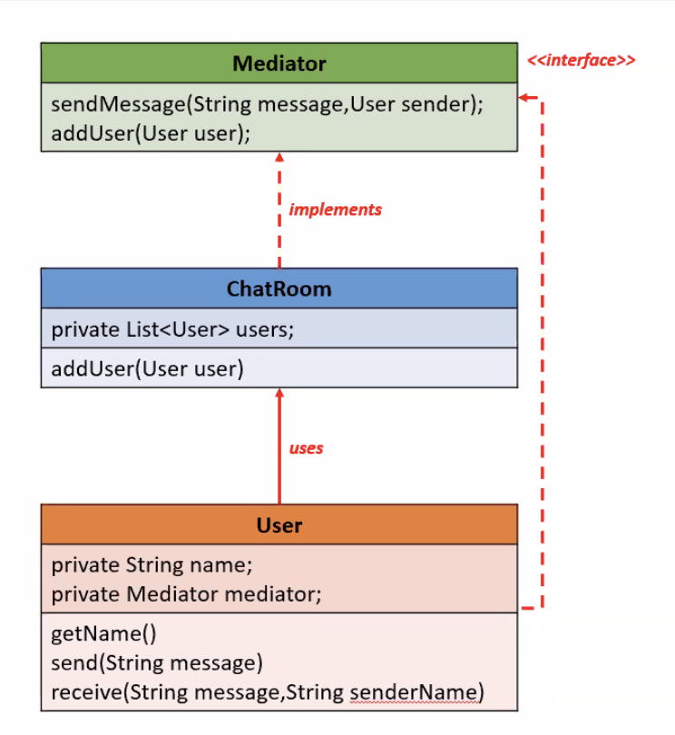

# Introduction of Mediator Design Pattern

The Mediator Pattern is a behavioral design pattern that defines an object (Mediator) to encapsulate how a set of objects interact. It promotes loose coupling by preventing objects from referring to each other explicitly, and it lets you alter their interaction independently.

## Characteristics of Mediator Design Pattern

 - Centralized communication between components.
 - Reduces direct dependencies (tight coupling) between components.
 - Makes code more maintainable and flexible.
 - Easy to add new colleagues or modify communication logic.
 - Components (Colleagues) talk to the Mediator, not to each other.

## Key Components

## Class Diagram

