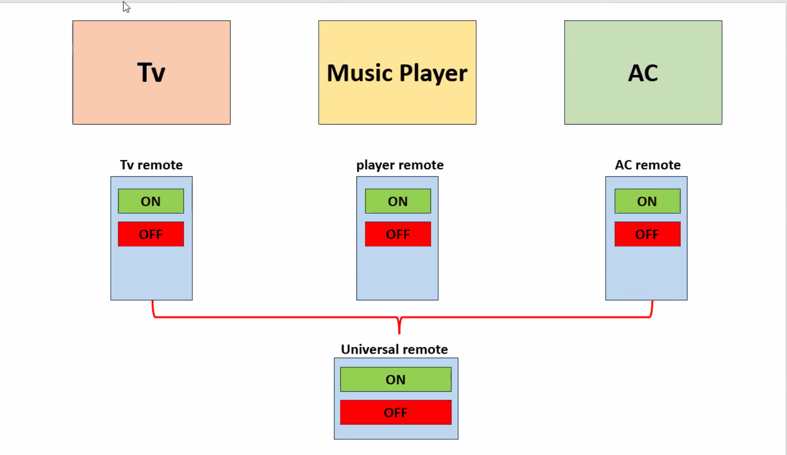
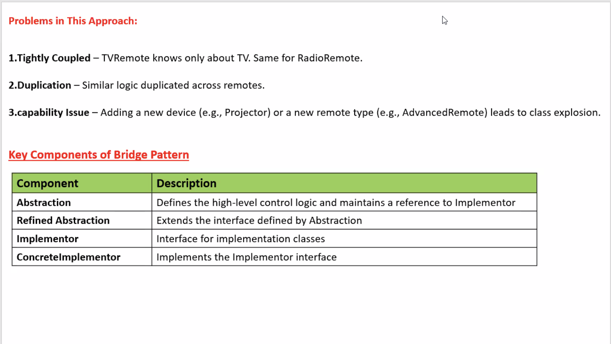

# Bridge Design Pattern

The Bridge Design Pattern is a structural pattern that decouples an abstraction from its implementation, allowing them to vary independently.

Intent:
 - Separate the abstractions from their implementations.
 - Enables flexibility and scalability in large systems.

