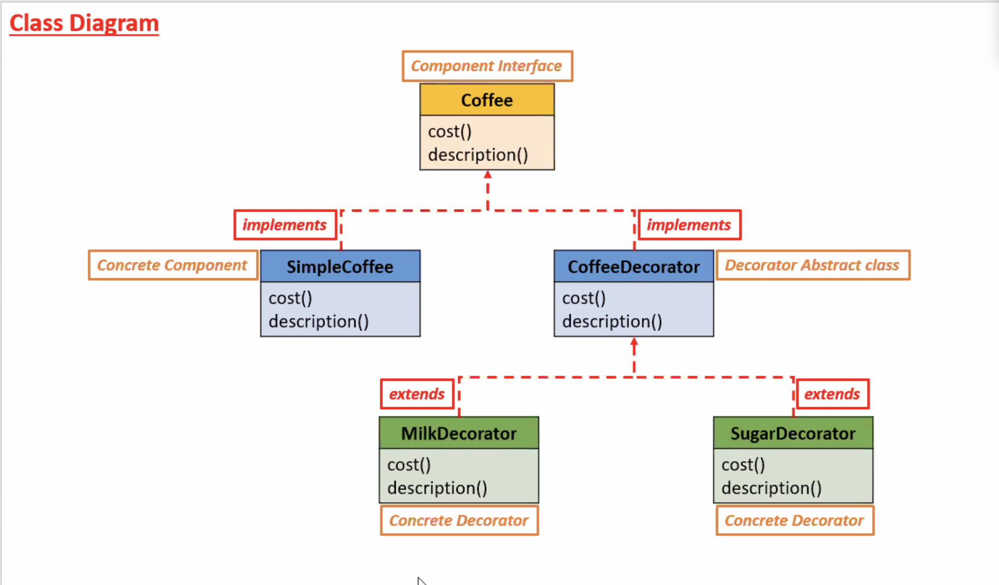

# Introduction to Decorator Design Pattern

## Definition:
The Decorator Design Pattern is a structural pattern that lets you *dynamically attach new behaviors or respoinsibilities* to an object *without modifing its structure*.

## Problem which it solves:
Avoids subclass explosion and promotes flexible code by using composition instead of inheritance.

## Characteristics:
- Uses composition over inheritance.
- Follows the Open/Closed Principle (OCP).
- Can wrap objects multiple times for layered functionality.
- Decorators and components share a common interface.

# Class Diagram:
